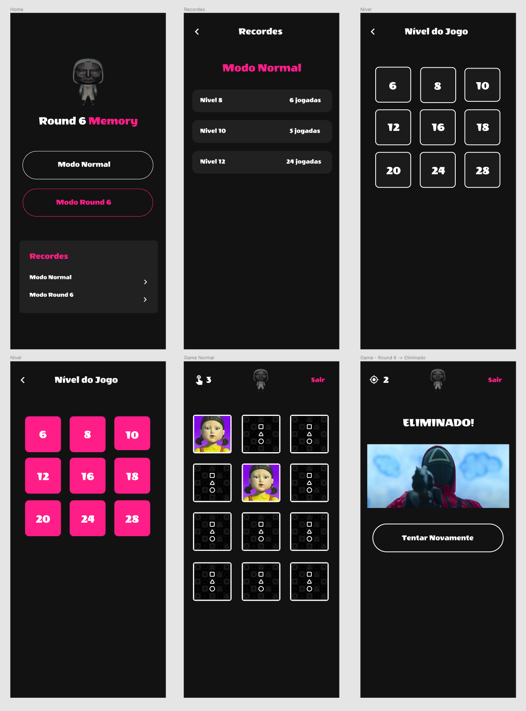

# Memory Game in Flutter

This project exemplifies a Memory Game in Flutter with the theme of the Round 6 series.

The project shows the concepts of Interface (UI) from a template created in Figma, Flip Card Animation to rotate a card when the user touches it, state management using Provider and MobX, and also a database for keep the records of moves in each level of the game.

